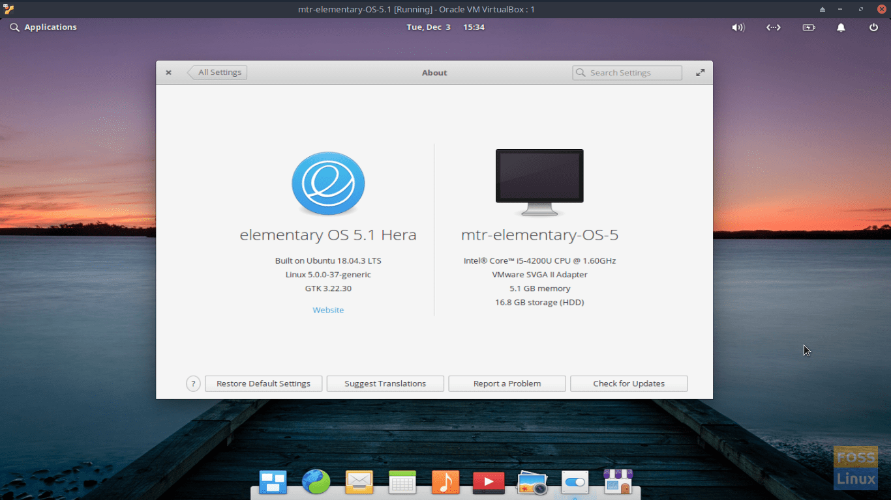

# Elementary OS Post Install Script



### Add ppa support
```
 sudo apt install software-properties-common 
```

### Install Elementary Tweaks
```
sudo add-apt-repository ppa:philip.scott/elementary-tweaks
sudo apt update
sudo apt install elementary-tweaks
```

### Install tlp tlp-rdw
```
 sudo add-apt-repository ppa:linrunner/tlp
 sudo apt update
 sudo apt-get install tlp tlp-rdw
```

### Apps
```
 Meld
 vlc
 Devhelp
 Inkscape
 xfce4-dict 
```

### Appcenter Apps
```
 Agenda
 Clipped
 Cyfrif
 Desktopfolder
 Eddy
 Fondo
 Notes Up
 Aesop
 Comgen
 Formatter
 Appeditor
 Gitignore
 Melody
 Memories
 Monitor
 Notejot
 Planner
 Quickdocs
 Reminduck
 Tardis
 Tasks
 Torrential
 Vocal
 Optimizer
 Regex Tester
 Develop
 Yishu
 Ghistory 
```